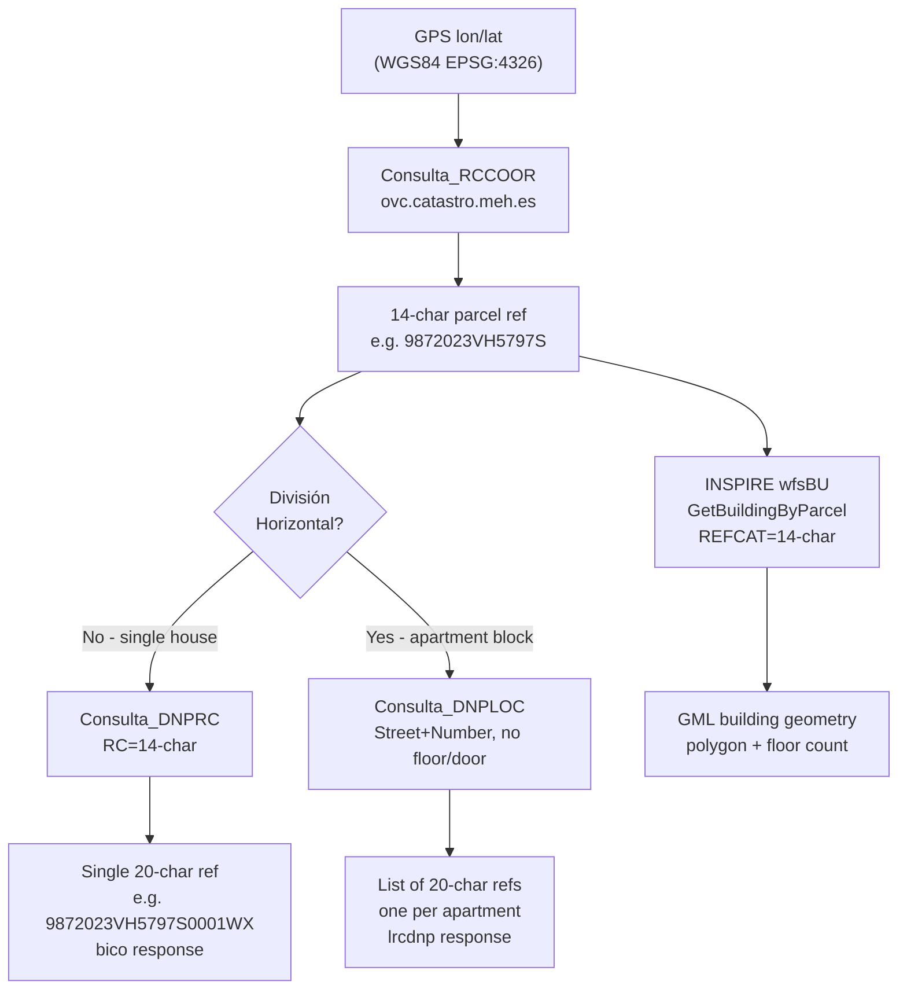

# GPS Coordinates → Spanish Cadastral Reference (Referencia Catastral) of a House

## Executive Summary

The Spanish Directorate General for Cadastre (Catastro) provides a free, unauthenticated REST/SOAP API to convert GPS coordinates into a **referencia catastral**. The process is a **mandatory two-step workflow**: (1) call `Consulta_RCCOOR` with lat/lon to get a 14-character **parcel**-level reference; (2) call `Consulta_DNPRC` or `Consulta_DNPLOC` with that reference to get the 20-character **building unit**-level reference for a specific house/apartment. Two generations of the API are live simultaneously — the newer WCF/JSON service is recommended for new development. Critical gotchas include XML namespace handling, SSL certificate issues, and completely different response schemas for single-unit buildings vs. apartment blocks (división horizontal).

---

## Table of Contents

1. [The Cadastral Reference Format](#1-the-cadastral-reference-format)
2. [API Services Overview](#2-api-services-overview)
3. [Step-by-Step: GPS → Building Reference](#3-step-by-step-gps--building-reference)
4. [API Endpoints Reference](#4-api-endpoints-reference)
5. [Response Structures](#5-response-structures)
6. [Complete Python Implementation](#6-complete-python-implementation)
7. [División Horizontal Detection](#7-división-horizontal-detection)
8. [INSPIRE/OGC WFS Services](#8-inspirewfs-services-building-geometry)
9. [Available Libraries](#9-available-libraries)
10. [Edge Cases and Gotchas](#10-edge-cases-and-gotchas)
11. [Confidence Assessment](#11-confidence-assessment)
12. [Footnotes](#footnotes)

---

## 1. The Cadastral Reference Format

A Spanish cadastral reference has two possible lengths:

```
14-character PARCEL reference (finca/plot):
┌─────────────────────────────────────────────┐
│  pc1 (7 chars)   │  pc2 (7 chars)           │
│   9872023        │   VH5797S                │
└─────────────────────────────────────────────┘
= "9872023VH5797S"

20-character BUILDING UNIT reference (inmueble):
┌─────────────────────────────────────────────────────────────────────┐
│  pc1 (7 chars)  │  pc2 (7 chars)  │  car (4 chars)  │  cc1+cc2 (2) │
│   9872023       │   VH5797S       │    0001         │   W  X       │
└─────────────────────────────────────────────────────────────────────┘
= "9872023VH5797S0001WX"
```

- **14 chars = parcel level** — what GPS reverse geocoding returns (a piece of land)
- **20 chars = individual property unit** — what you need for a specific house/apartment
- `car` (chars 15–18) uniquely identifies each dwelling unit within the parcel
- `cc1`+`cc2` (chars 19–20) are algorithmic checksum/control digits[^1]

---

## 2. API Services Overview

Two generations of API are simultaneously live as of 2025:

### Old ASMX Service (legacy, still functional)
- **Technology**: ASP.NET ASMX, SOAP + HTTP GET, XML-only responses
- **Coordinate base URL**: `https://ovc.catastro.meh.es/ovcservweb/OVCSWLocalizacionRC/`
- **Coordinate params**: `Coordenada_X` (longitude) / `Coordenada_Y` (latitude)
- **Used by**: `gisce/pycatastro` (⭐35), `sperea/catastro-lib-python`[^2]
- **Status**: Live, ~4 seconds average latency[^3]

### New WCF Service (modern, recommended)
- **Technology**: WCF with REST + JSON bindings
- **Coordinate base URL**: `http://ovc.catastro.meh.es/OVCServWeb/OVCWcfCallejero/`
- **Coordinate params**: `CoorX` (longitude) / `CoorY` (latitude)
- **JSON endpoint**: append `/json/MethodName?params` to the `.svc` URL
- **Used by**: `dapasca/api-catastro-for-humans`, `IvanitiX/ESCatastroLib`[^4]
- **Status**: Live

> **⚠️ Parameter naming trap**: The old ASMX WSDL defines XML schema elements as `CoorX`/`CoorY` but the HTTP GET query-string keys (WSDL `message part` names) are `Coordenada_X`/`Coordenada_Y`. These are NOT interchangeable between the two services.[^5]

---

## 3. Step-by-Step: GPS → Building Reference

```
GPS coordinates (WGS84 lat/lon)
          │
          ▼
┌─────────────────────────────────────────┐
│  STEP 1: Consulta_RCCOOR               │
│  GPS coords → 14-char parcel reference │
└─────────────────────────────────────────┘
          │
          │  pc1 + pc2 = "9872023VH5797S"
          ▼
┌─────────────────────────────────────────────────────────────────────────┐
│  STEP 2: Determine building type                                        │
│                                                                         │
│  Is it a single house / no división horizontal?                        │
│      → Call Consulta_DNPRC with 14-char RC                             │
│        Response contains <bico> with one unit's 20-char RC             │
│                                                                         │
│  Is it an apartment block (división horizontal)?                       │
│      → Call Consulta_DNPLOC with address (street+number, no floor/door)│
│        Response contains <lrcdnp> list: one 20-char RC per apartment   │
└─────────────────────────────────────────────────────────────────────────┘
          │
          ▼
20-character referencia catastral: "9872023VH5797S0001WX"
```

**Key rule**: `Consulta_RCCOOR` always returns a parcel (plot) reference — you cannot skip Step 2. For an apartment building, you must enumerate all units via `Consulta_DNPLOC`.[^6]

---

## 4. API Endpoints Reference

### Coordinate Services

| Operation | Old ASMX URL | Params | Returns |
|-----------|-------------|--------|---------|
| `Consulta_RCCOOR` | `.../OVCCoordenadas.asmx/Consulta_RCCOOR` | `SRS`, `Coordenada_X`, `Coordenada_Y` | Nearest parcel (14-char RC) |
| `Consulta_RCCOOR_Distancia` | `.../OVCCoordenadas.asmx/Consulta_RCCOOR_Distancia` | `SRS`, `Coordenada_X`, `Coordenada_Y` | All parcels within ~50m radius |
| `Consulta_CPMRC` | `.../OVCCoordenadas.asmx/Consulta_CPMRC` | `SRS`, `Provincia`, `Municipio`, `RefCat` | Coordinates for a known RC |

New WCF JSON equivalents: replace `.asmx` path with `COVCCoordenadas.svc/json/` and use `CoorX`/`CoorY`.[^4]

**Full live example URLs:**
```
# Old ASMX (XML):
https://ovc.catastro.meh.es/ovcservweb/OVCSWLocalizacionRC/OVCCoordenadas.asmx/Consulta_RCCOOR?SRS=EPSG:4326&Coordenada_X=-3.70379&Coordenada_Y=40.41677

# New WCF (JSON):
http://ovc.catastro.meh.es/OVCServWeb/OVCWcfCallejero/COVCCoordenadas.svc/json/Consulta_RCCOOR?SRS=EPSG:4326&CoorX=-3.70379&CoorY=40.41677
```

### Property Data Services (Step 2)

| Operation | URL | Params | Returns |
|-----------|-----|--------|---------|
| `Consulta_DNPRC` | `.../OVCCallejero.asmx/Consulta_DNPRC` | `Provincia`, `Municipio`, `RC` | Full data for a known RC; single-unit or multi-unit list |
| `Consulta_DNPLOC` | `.../OVCCallejero.asmx/Consulta_DNPLOC` | `Provincia`, `Municipio`, `Sigla`, `Calle`, `Numero`, `Bloque`, `Escalera`, `Planta`, `Puerta` | Units matching address — enumerate all apartments if floor/door omitted |
| `Consulta_DNPPP` | `.../OVCCallejero.asmx/Consulta_DNPPP` | `Provincia`, `Municipio`, `Poligono`, `Parcela` | Rural parcel data |

> **⚠️ Critical**: For legacy ASMX, the cadastral ref param is named `RC`. For the new WCF service, it is named `RefCat`. All optional parameters (`Provincia`, `Municipio`, `Bloque`, etc.) **must be present as empty strings** — omitting them entirely causes a SOAP body parser fault.[^7]

---

## 5. Response Structures

### Step 1 Response: `Consulta_RCCOOR` (XML)

```xml
<consulta_coordenadas xmlns="http://www.catastro.meh.es/">
  <coordenadas>
    <coord>
      <pc>
        <pc1>9872023</pc1>   <!-- chars 1-7 of parcel ref -->
        <pc2>VH5797S</pc2>   <!-- chars 8-14 of parcel ref -->
      </pc>
      <geo>
        <xcen>-3.70379</xcen>
        <ycen>40.41677</ycen>
        <srs>EPSG:4326</srs>
      </geo>
      <ldt>CL GLORIA 51 13730 SANTA CRUZ DE MUDELA (CIUDAD REAL)</ldt>
    </coord>
  </coordenadas>
</consulta_coordenadas>
```
Parcel reference = `pc1 + pc2` = `"9872023VH5797S"` (14 chars)[^8]

### Step 2A Response: Single Unit Building (`<bico>`)

When `<control><cudnp>` = `1`, the response contains a `<bico>` element:

```xml
<consulta_dnp xmlns="http://www.catastro.meh.es/">
  <control>
    <cudnp>1</cudnp>     <!-- 1 = single unit -->
    <cucons>3</cucons>   <!-- number of construction sub-elements -->
  </control>
  <bico>
    <bi>
      <idbi>
        <cn>UR</cn>      <!-- UR=Urban, RU=Rustic -->
        <rc>
          <pc1>9872023</pc1>
          <pc2>VH5797S</pc2>
          <car>0001</car>   <!-- unit identifier — KEY for 20-char ref -->
          <cc1>W</cc1>      <!-- control digit 1 -->
          <cc2>X</cc2>      <!-- control digit 2 -->
        </rc>
      </idbi>
      <dt>
        <!-- address block: street type, name, number, floor, door -->
        <locs><lous><lourb>
          <dir><tv>CL</tv><nv>GLORIA</nv><pnp>51</pnp></dir>
          <loint>
            <es>T</es>   <!-- escalera (staircase) -->
            <pt>OD</pt>  <!-- planta (floor) -->
            <pu>OS</pu>  <!-- puerta (door) -->
          </loint>
        </lourb></lous></locs>
      </dt>
      <debi>
        <luso>Residencial</luso>   <!-- primary use -->
        <sfc>308</sfc>             <!-- built area m² -->
        <cpt>100,000000</cpt>      <!-- participation coefficient: 100% = single unit -->
        <ant>1980</ant>            <!-- construction year -->
      </debi>
    </bi>
  </bico>
</consulta_dnp>
```
20-char reference = `pc1 + pc2 + car + cc1 + cc2` = `"9872023VH5797S0001WX"`[^9]

### Step 2B Response: Apartment Block, División Horizontal (`<lrcdnp>`)

When `<control><cudnp>` ≥ `2`, the response uses `<lrcdnp>` instead of `<bico>`:

```xml
<consulta_dnp xmlns="http://www.catastro.meh.es/">
  <control>
    <cudnp>2</cudnp>   <!-- 2+ = multiple units; response is a list -->
  </control>
  <lrcdnp>             <!-- "Lista de RC y DNP" — multi-unit container -->
    <rcdnp>
      <rc>
        <pc1>0545206</pc1>
        <pc2>VK4704F</pc2>
        <car>0001</car>   <!-- apartment 1 -->
        <cc1>R</cc1>
        <cc2>E</cc2>      <!-- 20-char: "0545206VK4704F0001RE" -->
      </rc>
      <dt>
        <locs><lous><lourb>
          <dir><tv>CL</tv><nv>ALCALA</nv><pnp>1</pnp></dir>
          <loint><pt>00</pt><pu>02</pu></loint>  <!-- ground floor, door 2 -->
        </lourb></lous></locs>
      </dt>
    </rcdnp>
    <rcdnp>
      <rc>
        <pc1>0545206</pc1>
        <pc2>VK4704F</pc2>
        <car>0002</car>   <!-- apartment 2 — different <car> value -->
        <cc1>T</cc1>
        <cc2>R</cc2>      <!-- 20-char: "0545206VK4704F0002TR" -->
      </rc>
      <dt>
        <locs><lous><lourb>
          <dir><tv>CL</tv><nv>ALCALA</nv><pnp>1</pnp></dir>
          <loint><pt>O0</pt><pu>01</pu></loint>  <!-- first floor, door 1 -->
        </lourb></lous></locs>
      </dt>
    </rcdnp>
    <!-- ... one <rcdnp> per apartment ... -->
  </lrcdnp>
</consulta_dnp>
```
[^10]

### Error Response (HTTP 200 always — check `<lerr>`)

```xml
<consulta_dnp>
  <lerr>
    <err>
      <cod>13</cod>
      <des>Referencia catastral no válida</des>
    </err>
  </lerr>
</consulta_dnp>
```

**Error codes**[^11]:
| Code | Meaning |
|------|---------|
| `01` | Generic server error — retry with backoff |
| `13` | RC checksum failed (invalid 20-char reference) |
| `14` | Street not found — normalize via `ConsultaVia` first |
| `99` | Malformed parameters (missing required keys) |

---

## 6. Complete Python Implementation

### Minimal Implementation (legacy ASMX, `requests` + `xmltodict`)

```python
import requests
import xmltodict

ASMX_COORDS = "https://ovc.catastro.meh.es/ovcservweb/OVCSWLocalizacionRC/OVCCoordenadas.asmx"
ASMX_CALLEJERO = "https://ovc.catastro.meh.es/ovcservweb/OVCSWLocalizacionRC/OVCCallejero.asmx"


def _strip_ns(xml_bytes: bytes) -> dict:
    """Parse XML and strip the Catastro default namespace to simplify XPath."""
    import re
    cleaned = re.sub(rb' xmlns="[^"]+"', b'', xml_bytes)
    return xmltodict.parse(cleaned, process_namespaces=False, xml_attribs=False)


def build_ref_cat(rc: dict) -> str:
    """Assemble a 20-character cadastral reference from its components."""
    return "".join(str(rc.get(p, "")) for p in ("pc1", "pc2", "car", "cc1", "cc2"))


def coords_to_parcel_ref(lon: float, lat: float, srs: str = "EPSG:4326") -> tuple[str, str]:
    """
    Step 1: GPS coordinates → 14-character parcel reference.
    Returns (parcel_ref, address_string).
    """
    resp = requests.get(
        f"{ASMX_COORDS}/Consulta_RCCOOR",
        params={"SRS": srs, "Coordenada_X": str(lon), "Coordenada_Y": str(lat)},
        verify=False,   # Catastro cert chain not trusted by default
        timeout=15,
    )
    data = _strip_ns(resp.content)
    root = data.get("consulta_coordenadas", {})

    if "lerr" in root:
        raise ValueError(f"No parcel at ({lat}, {lon})")

    coord = root["coordenadas"]["coord"]
    if isinstance(coord, list):
        coord = coord[0]  # take nearest

    parcel_ref = coord["pc"]["pc1"] + coord["pc"]["pc2"]  # 14 chars
    address = coord.get("ldt", "")
    return parcel_ref, address


def parcel_ref_to_building_units(parcel_ref: str) -> list[dict]:
    """
    Step 2: 14-character parcel ref → list of all 20-char building unit references.

    Returns a list of dicts with keys:
      - referencia: 20-char cadastral reference
      - direccion: address string
      - uso: primary use (e.g. "Residencial")
      - superficie: built area m²
      - antiguedad: construction year
      - planta: floor (if known)
      - puerta: door (if known)
    """
    resp = requests.get(
        f"{ASMX_CALLEJERO}/Consulta_DNPRC",
        params={"Provincia": "", "Municipio": "", "RC": parcel_ref},
        verify=False,
        timeout=15,
    )
    data = _strip_ns(resp.content)
    root = data.get("consulta_dnp", {})

    # --- Error path ---
    if "lerr" in root:
        err = root["lerr"].get("err", {})
        raise ValueError(f"Catastro error {err.get('cod')}: {err.get('des')}")

    # --- Single unit: <bico> present ---
    if "bico" in root:
        bi = root["bico"]["bi"]
        rc = bi["idbi"]["rc"]
        debi = bi.get("debi", {})
        loint = (bi.get("dt", {}).get("locs", {}).get("lous", {})
                   .get("lourb", {}).get("loint", {}))
        return [{
            "referencia": build_ref_cat(rc),
            "direccion": bi.get("ldt", ""),
            "uso": debi.get("luso"),
            "superficie": debi.get("sfc"),
            "antiguedad": debi.get("ant"),
            "planta": loint.get("pt"),
            "puerta": loint.get("pu"),
        }]

    # --- Multi-unit (división horizontal): <lrcdnp> present ---
    if "lrcdnp" in root:
        rcdnp_list = root["lrcdnp"].get("rcdnp", [])
        if isinstance(rcdnp_list, dict):
            rcdnp_list = [rcdnp_list]   # xmltodict collapses single item to dict

        results = []
        for entry in rcdnp_list:
            rc = entry.get("rc", {})
            loint = (entry.get("dt", {}).get("locs", {}).get("lous", {})
                         .get("lourb", {}).get("loint", {}))
            results.append({
                "referencia": build_ref_cat(rc),
                "planta": loint.get("pt"),
                "puerta": loint.get("pu"),
            })
        return results

    return []


# ── Convenience wrapper ───────────────────────────────────────────────────────

def gps_to_cadastral_building_refs(lon: float, lat: float) -> list[dict]:
    """
    Full pipeline: GPS (WGS84 lon/lat) → list of 20-char cadastral references.

    For a standalone house → returns a list with one entry.
    For an apartment block → returns one entry per apartment/unit.

    Usage:
        units = gps_to_cadastral_building_refs(lon=-3.70379, lat=40.41677)
        for unit in units:
            print(unit["referencia"])  # e.g. "9872023VH5797S0001WX"
    """
    parcel_ref, address = coords_to_parcel_ref(lon, lat)
    units = parcel_ref_to_building_units(parcel_ref)
    return units
```

### Using `pycatastro` Library (pip install pycatastro)

```python
from pycatastro import PyCatastro

# Step 1: GPS → parcel reference
result = PyCatastro.Consulta_RCCOOR("EPSG:4326", longitude, latitude)
# Navigate the parsed xmltodict response:
coord = result["consulta_coordenadas"]["coordenadas"]["coord"]
parcel_ref = coord["pc"]["pc1"] + coord["pc"]["pc2"]   # 14 chars

# Step 2: Parcel → building units
dnp = PyCatastro.Consulta_DNPRC(provincia="", municipio="", rc=parcel_ref)
```
[^2]

### New WCF / JSON Service (no XML parsing needed)

```python
import requests

WCF_COORDS = "http://ovc.catastro.meh.es/OVCServWeb/OVCWcfCallejero/COVCCoordenadas.svc/json"
WCF_CALLEJERO = "http://ovc.catastro.meh.es/OVCServWeb/OVCWcfCallejero/COVCCallejero.svc/json"

# Step 1
r1 = requests.get(f"{WCF_COORDS}/Consulta_RCCOOR",
                  params={"SRS": "EPSG:4326", "CoorX": lon, "CoorY": lat})
data1 = r1.json()["Consulta_RCCOORResult"]
coord = data1["coordenadas"]["coord"][0]
parcel_ref = coord["pc"]["pc1"] + coord["pc"]["pc2"]

# Step 2
r2 = requests.get(f"{WCF_CALLEJERO}/Consulta_DNPRC",
                  params={"Provincia": "", "Municipio": "", "RefCat": parcel_ref})
data2 = r2.json()["consulta_dnprcResult"]
```
[^4]

---

## 7. División Horizontal Detection

Use all three signals together for robustness[^12]:

| Signal | Single House | Apartment Block |
|--------|-------------|-----------------|
| `<control><cudnp>` | `1` | `2` or higher |
| XML root contains | `<bico>` | `<lrcdnp>` |
| `<debi><cpt>` | `100,000000` | < 100% (e.g. `"12,500000"`) |

```python
def is_division_horizontal(root: dict) -> bool:
    """True if parcel has multiple independent cadastral units (apartments)."""
    if "lrcdnp" in root:
        return True
    try:
        cpt = root["bico"]["bi"]["debi"]["cpt"]          # e.g. "100,000000"
        cpt_float = float(str(cpt).replace(".", "").replace(",", "."))
        return cpt_float < 99.9
    except (KeyError, TypeError, ValueError):
        return False
```
[^12]

---

## 8. INSPIRE/WFS Services (Building Geometry)

For building **footprint geometry** (polygons, floor counts), the Catastro also exposes INSPIRE-compliant WFS 2.0 services. These are useful if you need the physical building shape, not just the cadastral reference.[^13]

```
# Building WFS — accepts 14-char parcel reference, returns GML geometry
https://ovc.catastro.meh.es/INSPIRE/wfsBU.aspx?service=wfs&version=2.0.0
    &request=getfeature&STOREDQUERIE_ID=GetBuildingByParcel
    &REFCAT=9872023VH5797S&srsname=urn:ogc:def:crs:EPSG::4326

# Cadastral Parcel WFS
https://ovc.catastro.meh.es/INSPIRE/wfsCP.aspx?service=wfs&version=2.0.0
    &request=getfeature&STOREDQUERIE_ID=GetParcel
    &REFCAT=9872023VH5797S&srsname=urn:ogc:def:crs:EPSG::4326
```

> **Note**: The BU service defaults to `EPSG:25830` (UTM Zone 30N). Always pass `srsname=urn:ogc:def:crs:EPSG::4326` explicitly for WGS84. These services return the parcel-level building geometry, not individual apartment units.[^13]



---

## 9. Available Libraries

| Library | Language | Endpoint | Stars | Notes |
|---------|----------|----------|-------|-------|
| [`gisce/pycatastro`](https://github.com/gisce/pycatastro) | Python | Old ASMX (XML) | ⭐35 | Most mature; `Coordenada_X`/`Coordenada_Y` params |
| [`IvanitiX/ESCatastroLib`](https://github.com/IvanitiX/ESCatastroLib) | Python | New WCF + INSPIRE WFS | — | Returns shapely geometry objects |
| [`dapasca/api-catastro-for-humans`](https://github.com/dapasca/api-catastro-for-humans) | Python (FastAPI) | New WCF (JSON) | — | Best documentation; async; coordinate methods are stubs |
| [`karaokedurrif/Geotwin`](https://github.com/karaokedurrif/Geotwin) | Python | Old ASMX + INSPIRE WFS | — | Full async pipeline with building geometry |
| [`MrCabss69/Python-Catastro`](https://github.com/MrCabss69/Python-Catastro) | Python | Old ASMX (via pycatastro) | — | Pandas DataFrame output |
| [`rOpenSpain/CatastRo`](https://github.com/rOpenSpain/CatastRo) | R | Both | — | Available on CRAN |
| [`vaijira/shylock`](https://github.com/vaijira/shylock) | Rust | Old ASMX (XML) | — | Production auction tool |

**Recommended for new Python projects**: Use `gisce/pycatastro` for simplicity, or make direct HTTP calls to the new WCF/JSON service to avoid XML parsing entirely.

---

## 10. Edge Cases and Gotchas

### SSL Certificate Issues
The `ovc.catastro.meh.es` domain uses an intermediate CA not trusted by default in Python/macOS. Add `verify=False` or inject the Spanish FNMT root CA bundle.[^14]

### ~4 Second Latency Floor
Every API call takes approximately 4 seconds regardless of payload size. For multi-property lookups, use async clients (`httpx.AsyncClient` or `asyncio.gather`).[^11]

### XML Namespace — Silent Parser Failure
All responses carry `xmlns="http://www.catastro.meh.es/"`. Without stripping this, `xmltodict` results look like: `{"http://www.catastro.meh.es/:consulta_dnp": {...}}`. Strip with `re.sub(r' xmlns="[^"]+"', '', xml_str)` before parsing, or use `xmltodict.parse(..., process_namespaces=True)` and prefix keys accordingly.[^15]

### `xmltodict` Single-Item Collapse
When a building has only one apartment, `<lrcdnp><rcdnp>` is a single XML element. `xmltodict` converts it to a `dict` instead of a `list[dict]`. Always normalize: `if isinstance(rcdnp, dict): rcdnp = [rcdnp]`.[^16]

### Basque Country and Navarre Excluded
These autonomous communities have their own independent cadastral systems and are **not covered** by the national Catastro API. Separate regional services exist.[^14]

### Rural Properties (`cn = "RU"`)
`Consulta_RCCOOR` on a farm field returns a 14-char parcel with `<cn>RU</cn>`. Use `Consulta_DNPPP` (polygon + parcel number) instead of address-based `Consulta_DNPLOC`. Rural references rarely have división horizontal.[^11]

### Empty Parameter Keys Required
`Provincia=` and `Municipio=` must appear as empty-string query parameters. Omitting the keys entirely causes a SOAP body parser fault returning error code `99`.[^7]

---

## 11. Confidence Assessment

| Finding | Confidence | Basis |
|---------|-----------|-------|
| Two-step workflow (RCCOOR → DNPRC/DNPLOC) | **High** | Verified by live API calls + multiple library implementations |
| Old ASMX params `Coordenada_X`/`Coordenada_Y` | **High** | Confirmed from live WSDL + pycatastro source |
| New WCF params `CoorX`/`CoorY` | **High** | Confirmed from live WSDL + XSD schema |
| `cudnp=1` → `<bico>`, `cudnp=2+` → `<lrcdnp>` | **High** | Verified with live multi-unit response |
| `<cpt>` as división horizontal indicator | **High** | Live response showed `100,000000` for single unit |
| INSPIRE WFS BU service for geometry | **High** | Live GetCapabilities confirmed |
| Catastro does not cover Basque/Navarre | **High** | Multiple sources |
| ~4 second latency | **Medium** | Documented in `dapasca` docs; matches library timeout settings |
| `Consulta_DNPRC` tolerance of 14-char RC | **Medium** | Observed in live test but undocumented |
| WCF/JSON endpoint stability long-term | **Medium** | No official end-of-life notice found for old ASMX, nor SLA for new WCF |

---

## Footnotes

[^1]: Cadastral reference format: [dapasca/api-catastro-for-humans](https://github.com/dapasca/api-catastro-for-humans) — `api_deepsearch_documentation.md` architecture section; [dapasca/api-catastro-for-humans](https://github.com/dapasca/api-catastro-for-humans) — `src/transform/mappers.py` `_build_ref_cat()` function

[^2]: pycatastro library: [gisce/pycatastro](https://github.com/gisce/pycatastro) — `pycatastro/__init__.py` lines 295–315 (`Consulta_RCCOOR`) and `Consulta_DNPRC` method

[^3]: Old ASMX service status: Live WSDL confirmed at `https://ovc.catastro.meh.es/ovcservweb/OVCSWLocalizacionRC/OVCCoordenadas.asmx?wsdl`; `Consulta_RCCOOR` HTTP GET returns valid XML with `xmlns="http://www.catastro.meh.es/"`

[^4]: New WCF/JSON service: [IvanitiX/ESCatastroLib](https://github.com/IvanitiX/ESCatastroLib) — `src/escatastrolib/utils/statics.py` lines 1–8; [dapasca/api-catastro-for-humans](https://github.com/dapasca/api-catastro-for-humans) — `src/config.py` `catastro_coordenadas_url`; Live WCF WSDL confirmed at `http://ovc.catastro.meh.es/OVCServWeb/OVCWcfCallejero/COVCCoordenadas.svc?wsdl`

[^5]: Parameter naming discrepancy: Live WSDL at `OVCCoordenadas.asmx?wsdl` — `<wsdl:message name="Consulta_RCCOORHttpGetIn">` part names are `Coordenada_X`/`Coordenada_Y`; Live XSD at `COVCCoordenadas.svc?xsd=xsd0` — element names are `CoorX`/`CoorY`

[^6]: Step 2 necessity: [OpenICGC/QgisPlugin](https://github.com/OpenICGC/QgisPlugin) — `geofinder3/catastro.py` `CatastroClient` class; [karaokedurrif/Geotwin](https://github.com/karaokedurrif/Geotwin) — `engine/cadastre/refcat.py` lines 64–392 `coords_to_building_ref()` async implementation

[^7]: Empty parameter keys requirement: [dapasca/api-catastro-for-humans](https://github.com/dapasca/api-catastro-for-humans) — `api_deepsearch_documentation.md` note on SOAP parse failure; [gisce/pycatastro](https://github.com/gisce/pycatastro) — `pycatastro/__init__.py` `Consulta_DNPRC` implementation using `Provincia=` and `Municipio=` as empty strings; `RefCat` vs `RC` param name: [dapasca/api-catastro-for-humans](https://github.com/dapasca/api-catastro-for-humans) — `src/extract/callejero.py` lines 74–84

[^8]: Step 1 live response: Verified by direct GET to `OVCCoordenadas.asmx/Consulta_RCCOOR` with Valencia coords `lon=-0.375, lat=39.47` → returned `pc1=5824404, pc2=YJ2752D` (parcel ref `5824404YJ2752D`); also tested Barcelona `lon=2.155722, lat=41.370020` via new WCF JSON endpoint → returned same parcel-level reference structure

[^9]: Single-unit `<bico>` response: Live call to `Consulta_DNPRC?RC=9872023VH5797S0001WX` returned `<cudnp>1</cudnp>` + `<cpt>100,000000</cpt>` confirming single-unit; `<car>0001</car><cc1>W</cc1><cc2>X</cc2>` confirmed by live XML; [dapasca/api-catastro-for-humans](https://github.com/dapasca/api-catastro-for-humans) — `src/transform/mappers.py` `map_property()` parsing this structure

[^10]: Multi-unit `<lrcdnp>` response: [dapasca/api-catastro-for-humans](https://github.com/dapasca/api-catastro-for-humans) — `api_deepsearch_documentation.md` example for Calle Alcala 1, Madrid; `<lrcdnp>/<rcdnp>` schema confirmed by live `Consulta_DNPLOC` call with street+number but no floor/door

[^11]: Error codes and latency: [dapasca/api-catastro-for-humans](https://github.com/dapasca/api-catastro-for-humans) — `api_deepsearch_documentation.md` error code table and latency note ("frequently averaging exactly four seconds per transaction")

[^12]: División horizontal detection signals: [dapasca/api-catastro-for-humans](https://github.com/dapasca/api-catastro-for-humans) — `src/transform/mappers.py` lines 177–220 (`_unwrap_property_result`, `_as_list`); `<cpt>` field interpretation from live response showing `100,000000` for single-unit

[^13]: INSPIRE WFS services: Live GetCapabilities at `https://ovc.catastro.meh.es/INSPIRE/wfsBU.aspx?service=wfs&version=2.0.0&request=GetCapabilities`; DescribeStoredQueries response listing `GetBuildingByParcel`, `GetBuildingPartByParcel`; [IvanitiX/ESCatastroLib](https://github.com/IvanitiX/ESCatastroLib) — `src/escatastrolib/utils/statics.py` `URL_BASE_WFS_EDIFICIOS`; [karaokedurrif/Geotwin](https://github.com/karaokedurrif/Geotwin) — `engine/cadastre/refcat.py` lines 34–40 GML namespace definitions

[^14]: Regional exclusions and SSL: [dapasca/api-catastro-for-humans](https://github.com/dapasca/api-catastro-for-humans) — `api_deepsearch_documentation.md` ("lacks specific intermediate certificate authorities recognized by default"); Basque/Navarre exclusion from same documentation

[^15]: XML namespace handling: [dapasca/api-catastro-for-humans](https://github.com/dapasca/api-catastro-for-humans) — `api_deepsearch_documentation.md` ("Failure to account for this default, un-prefixed namespace... is a ubiquitous point of failure")

[^16]: `xmltodict` single-item collapse: [dapasca/api-catastro-for-humans](https://github.com/dapasca/api-catastro-for-humans) — `src/transform/mappers.py` `_as_list()` helper function
